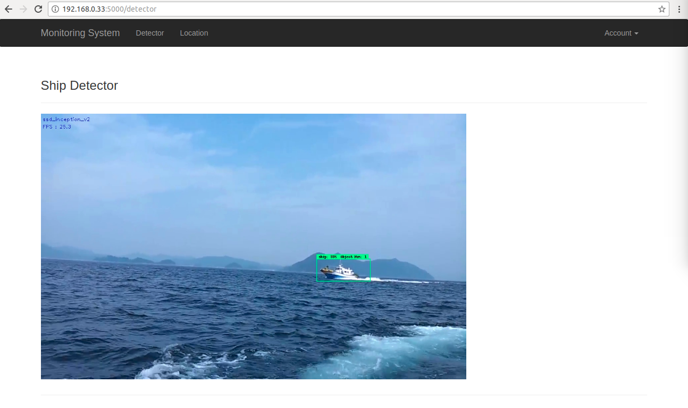
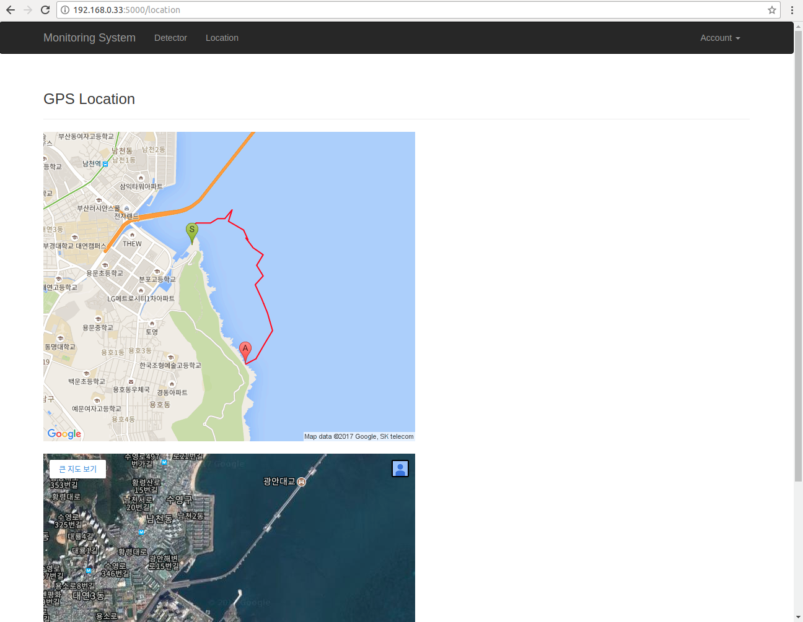

# Monitoring System with Ship

Ship monitoring system using Web Interface

## Requirements

- Ubuntu 16.04
- Python 3.5
- [Tensorflow 1.2](http://yongyong-e.tistory.com/10)
- [OpenCV 3.2](http://yongyong-e.tistory.com/41)

## Dependencies

- pip3 install -r requirements.txt

## Getting Started

Run :
- python3 monitoring_app.py {filename.mp4}

  

  

 

### The project is in progress.
